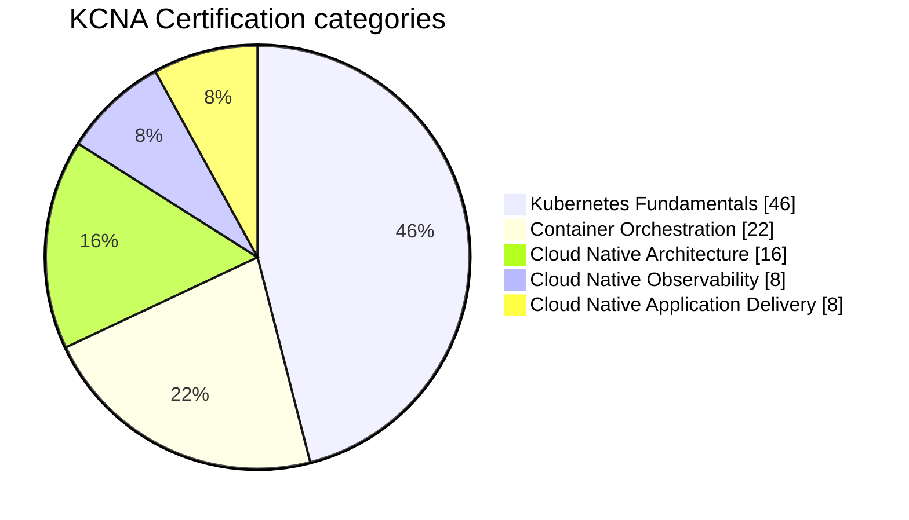
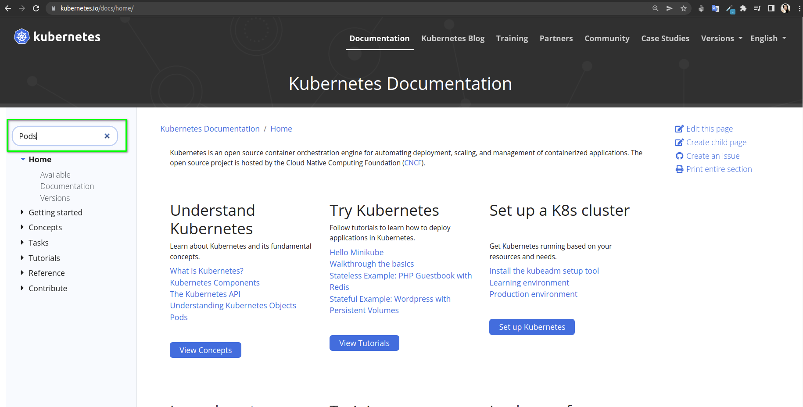
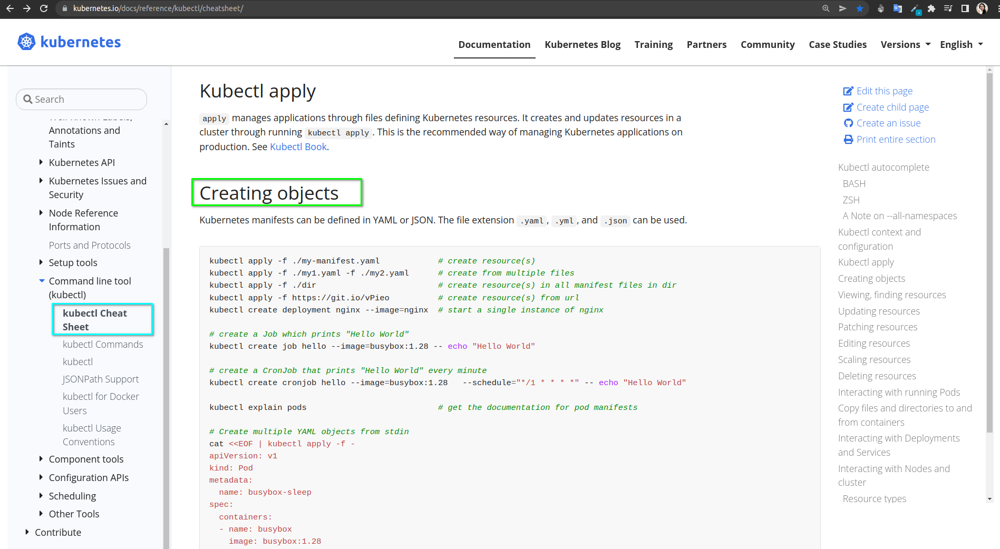
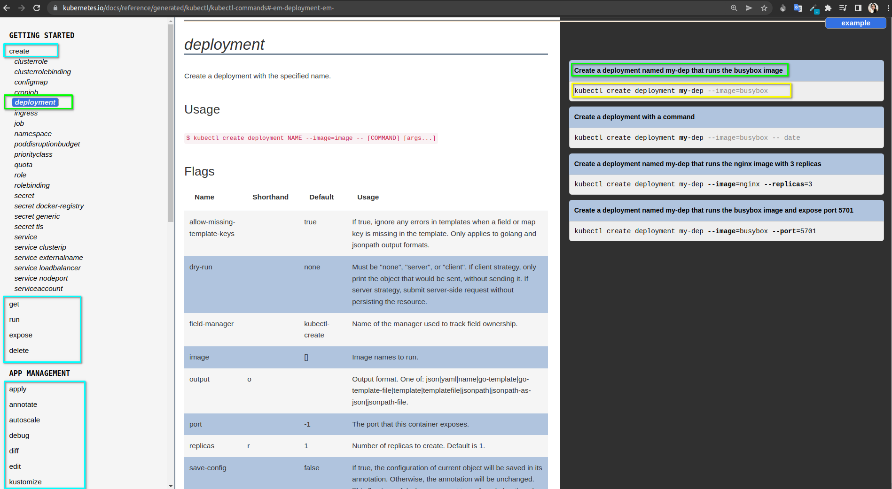
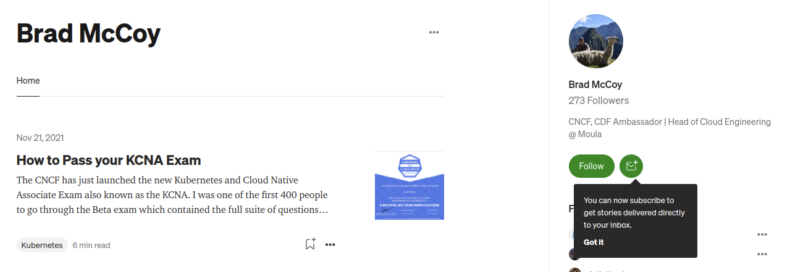
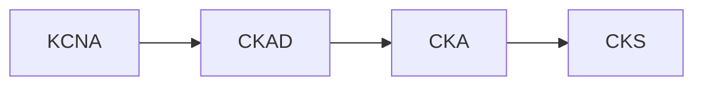

# Kubernetes and Cloud Native Associate Certification - KCNA ☸️ :books: :horse_racing: :trumpet:
 

  

**Kubernetes and Cloud Native Associate (KCNA)** is a certification exam to understand fundamental **Kubernetes** knowledge and skills. The **KCNA** exam aims to prepare candidates to work with cloud-native technologies and earn more CNCF credentials, including CKA (Certified Kubernetes Administrator), CKAD (Certified Kubernetes Application Developer), and CKS (Certified Kubernetes Security Specialist).

The exam has a [cost](https://training.linuxfoundation.org/certification/kubernetes-cloud-native-associate/) and, if you are willing to take this exam and you cannot afford it, you can get the [LiFT Scholarships](https://www.linkedin.com/posts/the-linux-foundation_learnlinux-liftscholar-itjobs-activity-6921156085902934016-ekb2?utm_source=linkedin_share&utm_medium=member_desktop_web) that are opened every year, stay tuned! :)

The exam is an online, proctored, and with multiple choices. These are the domains with their respective weights.

:zap: Read more about the [KCNA Certification official site](https://www.cncf.io/certification/kcna/)

# Resources :fuelpump:

:star: The [Oficial Kubernetes Documentation](https://kubernetes.io/docs/home/) site is the ideal place to clear your doubts, deepen the topics, and obtain examples. Everything about Kubernetes is on the official site, maintained/translated by the community.
Use the search box to get complete information about the Kubernetes resource you are looking for.

  

:dolphin: It is very important that you read  [kubectl Cheat Sheet](https://kubernetes.io/docs/reference/kubectl/cheatsheet/#kubectl-context-and-configuration) page, that has the basics to configure kubectl, create, view, find, update, patch, edit, scale, and delete resources, also interact with running Pods, copy files and directories to and from containers, interacting with Deployments and Services, interacting with Nodes and cluster, formatting output,

  

:bird: On this page [Kubectl Commands](https://kubernetes.io/docs/reference/generated/kubectl/kubectl-commands#-strong-getting-started-strong-) you will find all the commands used to create Kubernetes resources in an imperative way (without a file in between), for this exam you don't need to learn all those, but if you need to know the basics, for example : how to create resources, how to check if they are created, how to get more detail about them, how to access them for troubleshooting purposes, also how to review the logs of those resources.

  

:crocodile: You need to know the CNCF ecosystem with [CNCF Cloud Native Interactive Landscape](https://landscape.cncf.io/) which attempts to categorize most of the projects and product offerings in the cloud native space.

  

:bell: :blush: Great article  [How to Pass your KCNA Exam - Brad McCoy ](https://blog.bradmccoy.io/how-to-pass-your-kcna-exam-cf98cfa7d70f)

  

:seedling: [KCNA Kubernetes and cloud native associate certification](https://www.youtube.com/watch?v=iGkFHB1kFZ0) by Saiyam Pathak.

  

:paw_prints: [freeCodeCamp.org CNCF Kubernetes and Cloud Native Associate Certification Course (KCNA)](https://www.youtube.com/watch?v=AplluksKvzI&t=23521s) by @andrewbrown, the lectures are free on youtube, if you want to access practices, flash cards, notes and more explanation, there is a paid version of this course [exampro.co](https://app.exampro.co/student/journey/kcna)(I used this last one)

  

# Practice Exam :rocket:

* [KCNA Practice Exam cloudqns.co.uk](https://cloudqns.co.uk/)

* [101daysofdevops.com Kubernetes and Cloud Essentials](https://www.101daysofdevops.com/courses/kubernetes-and-cloud-native-essentials-lfs250/)

* [KCNA Practice Questions](https://docs.google.com/forms/d/e/1FAIpQLSf576oZ_cz5DwC_5P7b63p8sT_dfn-IhFEq40xGEENXUXTMKw/viewform?embedded=true)

# Study Tips  :notes:  :pencil2: :swimmer:

:heavy_check_mark: After setting your exam date, plan your study time, I suggest consecutive days, the exam covers various concepts extensively, and it will be easy to remember what you learned the day before.

:heavy_check_mark: Take notes, use documents in Google Drive and use colors to highlight. Create your own graphics, use your best study technique.

:heavy_check_mark: Follow a more detailed structure to study, in this video made by Andrew Brown in the comments section you will find the topics covered in the exam in detail. :vertical_traffic_light:

:heavy_check_mark: Use PostIts shpin: to easily remember concepts that are very difficult for you to assimilate, I used it to differentiate between Deployments, StatefulSets vs DaemonSets.

:heavy_check_mark: It would be nice if I could find a study partner, it's one of the ways that works for me, my study partner were [Aditya Narayan](https://www.linkedin.com/in/aditya-narayan-nayak/) who shared key resources and [Christian Rebischke](https://twitter.com/Sh1bumi) who I asked a lot.

:heavy_check_mark: Deepens unclear concepts, do not stay with doubts, make questions :)

:heavy_check_mark: On the day of the exam, sleep well, because even if they are questions with alternatives, if you are exhausted it will be difficult for you to understand the questions.

:heavy_check_mark: Check the name of your exam carefully, if it is wrong you will not be able to change it that same day and you will not be able to take the exam.

:heavy_check_mark: Please be patient with your supervisor, the validation process took me about 50 minutes, you must stay awake while waiting for the validations. :)

:heavy_check_mark: Keep your work area clear, and read the exam instructions on the [official page](https://docs.linuxfoundation.org/tc-docs/certification/important-instructions-kcna), if you do not follow them to the letter you will delay the start of your exam.

# Exam Tips  :notes:  :snowman: :swimmer:

:heavy_check_mark: Already in the exam, use the **FLAGS** :flags:, if you have any questions. Reserve time at the end for you to review them all.

:heavy_check_mark: Check all the alternatives before choosing your final answer, some of them may be misleading."

:herb: Do your best and learn as much as you can, that's what matters most.

#  Certificate of Completion :art: :guitar:

This is the certificate you get after certification with an official badged.

  

:heavy_check_mark: [Badge](https://www.credly.com/badges/ab0f9d54-931a-412d-a6e3-9f0a04771c5e)

If you are interested in more Kubernetes certifications, hese is the list of them:

* Kubernetes and Cloud Native Associate (KCNA)
* Certified Kubernetes Application Developer (CKAD)
* Certified Kubernetes Administrator (CKA)
* Certified Kubernetes Security Specialist (CKS)
