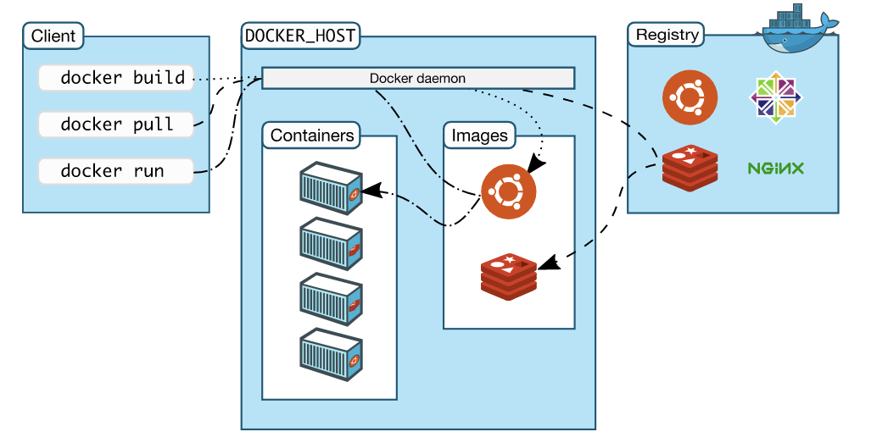

# Kubernetes and Cloud Native Associate Certification

[About the certification](https://www.cncf.io/certification/kcna/)

**Exam details**

| Domain | Weight  |
|--------|---------|
| Kubernetes Fundamentals	   |46% |
| Container Orchestration	 | 22% |
| Cloud Native Architecture	   | 16% |
| Cloud Native Observability	 | 8% |
| Cloud Native Application Delivery  | 8%|

Source [Linux Fundation Trining and Certification](https://training.linuxfoundation.org/certification/kubernetes-cloud-native-associate/)

# Some basic concepts

## Docker Architecture

  

Source: docs.docker.com/get-started/overview/

## Docker Basic Commands

## Kubernetes Architecture

## Kubernetes Components

  

Source: Julia Evans @b0rk

# Resources Videos
* [Oficial Kubernetes Documentation](https://kubernetes.io/docs/home/)
* [CNCF Cloud Native Interactive Landscape](https://landscape.cncf.io/)
* [freeCodeCamp.org CNCF Kubernetes and Cloud Native Associate Certification Course (KCNA)](https://www.youtube.com/watch?v=AplluksKvzI&t=23521s)
* [Saiyam Pathak KCNA Kubernetes and cloud native associate certification](https://www.youtube.com/watch?v=iGkFHB1kFZ0)

# Training:
* [101daysofdevops.com Kubernetes and Cloud Essentials](https://www.101daysofdevops.com/courses/kubernetes-and-cloud-native-essentials-lfs250/)
* [KCNA Practice Exam cloudqns.co.uk](https://cloudqns.co.uk/)

