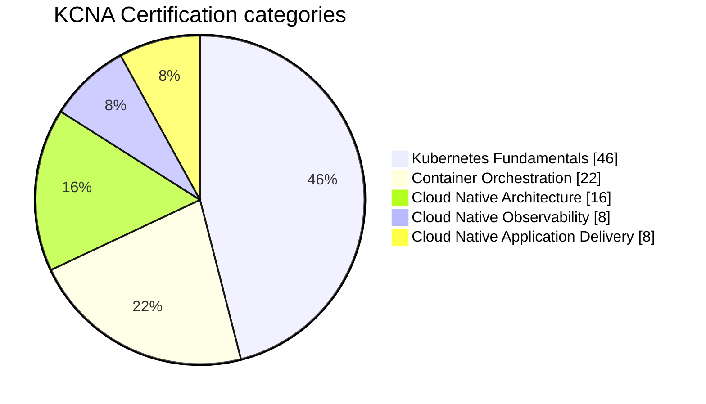
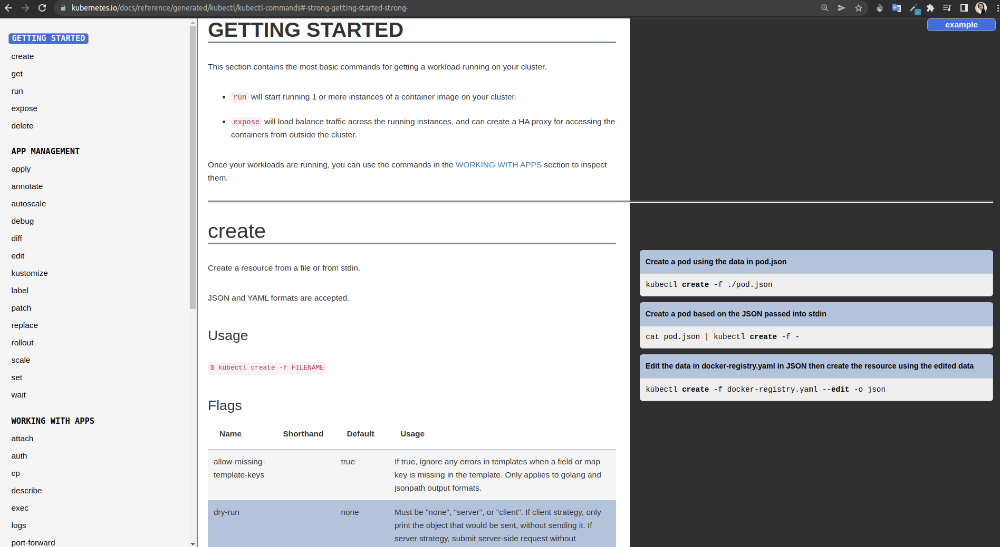
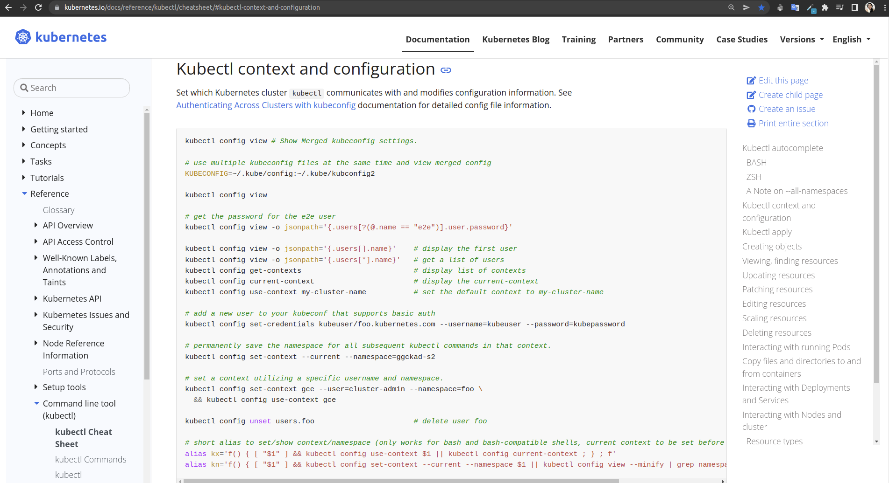
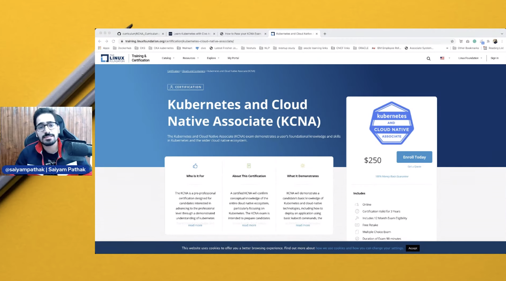
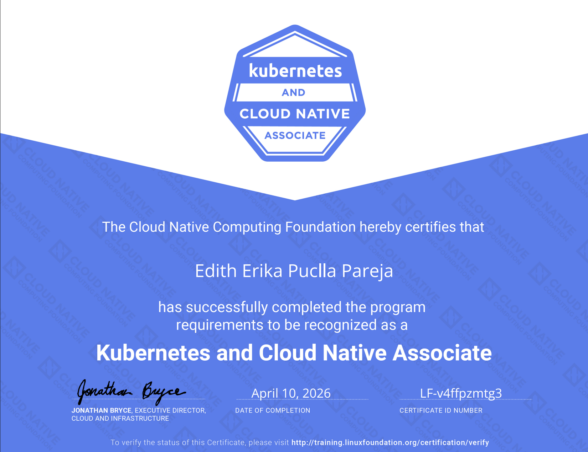

# Kubernetes and Cloud Native Associate Certification - KCNA ☸️ :books: :horse_racing: :trumpet:
 

  

**Kubernetes and Cloud Native Associate (KCNA)** is a certification exam to understand fundamental **Kubernetes** knowledge and skills. The **KCNA** exam aims to prepare candidates to work with cloud-native technologies and earn more CNCF credentials, including CKA (Certified Kubernetes Administrator), CKAD (Certified Kubernetes Application Developer), and CKS (Certified Kubernetes Security Specialist).

The exam has a [cost](https://training.linuxfoundation.org/certification/kubernetes-cloud-native-associate/) and, if you are willing to take this exam and you cannot afford it, you can get the [LiFT Scholarships](https://www.linkedin.com/posts/the-linux-foundation_learnlinux-liftscholar-itjobs-activity-6921156085902934016-ekb2?utm_source=linkedin_share&utm_medium=member_desktop_web) that are opened every year, stay tuned! :)

The exam is an online, proctored, and with multiple choices. These are the domains with their respective weights.

[Read more about the KCNA certification](https://www.cncf.io/certification/kcna/)

# Resources :fuelpump:

* [Oficial Kubernetes Documentation](https://kubernetes.io/docs/home/)

* [Kubectl commands](https://kubernetes.io/docs/reference/generated/kubectl/kubectl-commands#create)

  

* [kubectl Cheat Sheet](https://kubernetes.io/docs/reference/kubectl/cheatsheet/#kubectl-context-and-configuration)

  

* [CNCF Cloud Native Interactive Landscape](https://landscape.cncf.io/)

  

* [How to Pass your KCNA Exam - Brad McCoy ](https://blog.bradmccoy.io/how-to-pass-your-kcna-exam-cf98cfa7d70f)

* [Saiyam Pathak KCNA Kubernetes and cloud native associate certification](https://www.youtube.com/watch?v=iGkFHB1kFZ0)

  

* [freeCodeCamp.org CNCF Kubernetes and Cloud Native Associate Certification Course (KCNA) @andrewbrown](https://www.youtube.com/watch?v=AplluksKvzI&t=23521s), lectures are free on youtube, if you want to access to practice test, flashcards and notes thre is a paid version of this course in exampro.

  

* [exampro.co by @andrewbrown](https://app.exampro.co/student/journey/kcna)

# Practice Exam :rocket:

* [KCNA Practice Exam cloudqns.co.uk](https://cloudqns.co.uk/)

* [101daysofdevops.com Kubernetes and Cloud Essentials](https://www.101daysofdevops.com/courses/kubernetes-and-cloud-native-essentials-lfs250/)

* [KCNA Practice Questions](https://docs.google.com/forms/d/e/1FAIpQLSf576oZ_cz5DwC_5P7b63p8sT_dfn-IhFEq40xGEENXUXTMKw/viewform?embedded=true)

# Study/exam Tips  :notes:  :pencil2: :swimmer:

* After setting your exam date, plan your study time, I suggest consecutive days, the exam covers various concepts extensively, and it will be easy to remember what you learned the day before.

* Take notes, use documents in Google Drive and use colors to highlight. Create your own graphics, use your best study technique.

* Follow a more detailed structure to study, in this video made by Andrew Brown in the comments section you will find the topics covered in the exam in detail.

* Use PostIts to easily remember concepts that are very difficult for you to assimilate, I used it to differentiate between StatefulSet and DaemonSet

* It would be nice if I could find a study partner, it's one of the ways that works for me, my study partner was Aditiya who shared key resources that helped me pass the exam.

* Deepens unclear concepts, do not stay with doubts, ask :)

* On the day of the exam, sleep well, because even if they are questions with alternatives, if you are exhausted it will be difficult for you to understand the questions (it happened to me in the Practice exam)

* Check the name of your exam carefully, if it is wrong you will not be able to change it that same day and you will not be able to take the exam.

* Please be patient with your supervisor, the validation process took me about 50 minutes, you must stay awake while waiting for the validations. Stay awake :)

* Keep your work area clear, and read the exam instructions on the official page, if you do not follow them to the letter you will delay the start of your exam.

* Already in the exam, use the FLAGS, if you have any questions. Reserve time at the end for you to review them all.

* Check all the alternatives before choosing your final answer, some of them may be misleading."

#  Certificate of Completion :art: :guitar:

  

:heavy_check_mark: [Badge](https://www.credly.com/badges/ab0f9d54-931a-412d-a6e3-9f0a04771c5e)